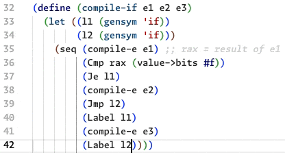

  

  
  
  
  
  

# Code Scope Highlighter - A Highlighter Extension for Better Readability

A customizable scope highlighter, inspired by Dr Racket IDE.

## ✨ Features
- **Universal highlighting:** ScopeHighlighter works on any language!
- **Dynamic Highlighting:** Instantly see the scope of matching brackets with vibrant colors.
- **Customizable Colors:** Personalize your highlight colors for brackets, braces, and parentheses.
- **Flexible Modes:** Choose from "near", "always", or "never" highlight modes to suit your coding style.
- **(Soon) Language Specific Settings:** Enable or disable highlighting for specific programming languages.

## 🌟 Why ScopeHighlighter?
- **Boost Productivity:** Quickly understand the structure of your code, making it easier to debug and develop.
- **Enhanced Readability:** No more squinting at matching brackets; ScopeHighlighter makes it clear and straightforward.
- **Seamless Integration:** Works effortlessly and fast within the VS Code ecosystem, either on desktop or the browser, thanks to the bundler `esbuild`.

## ⚙️ Extension Settings

The following settings are configured for the scope-highlighter extension:

### Match Brackets
- **Default**: `near`
- **Description**: Choose when the scope highlight should be active:
    - `near` for when the cursor is near the bracket,
    - `always` to always highlight,
    - `never` to never highlight.

### Scope Color
- **Default**: `#4d4d4d30`
- **Description**: Color for highlighting the entire scope of matching brackets. (Hex format)

### Bracket Color
- **Default**: `#4d4d4d30`
- **Description**: Color for highlighting the matching brackets. (Hex format)

## 🗺️ Roadmap 

- [ ] **Language Specific Settings:** Implement highlighting for specific programming languages.
- [ ] **HTML support:** Implement highlighting for nested html tags.

## 📄 License

This project is licensed under the **MIT** - see the [MIT](https://github.com/xavimondev/easyreadme/blob/main/LICENSE) file for details.

